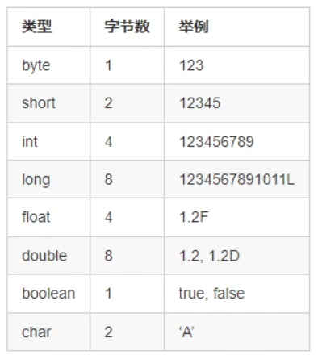
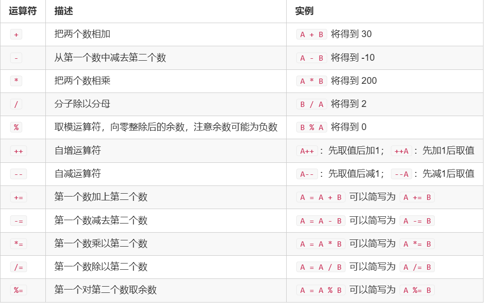

# **1.1 变量、运算符、表达式、输入与输出*

## 语法基础

### 1、变量

内置数据类型



**特别的，float 保留小数6-7位，double保留小数15-16位**，后面的值是不精确的

```java
public class Main{
    public static void main(String[] args){
        byte x = -1;
        float y = 1.0F;
        double z = 1D;
        boolean flag = true;
        char c = 'A';
        int d = (int)c;
        System.out.println(d);
    }
}
```

### 常用的ASCII码


final：修饰为常量

```java
final int N = 110;
```

类型转化：

```java
显式转化：int x = (int)'A';
隐式转化：double x = 12, y = 4 * 3.3;
```

### 2、运算符

```
A = 10， B = 20；
```



### 3、表达式

**Java和C中计算取整为向0取整，Python为向下取整**

整数加减乘除四则运算：

```java
public class Main{
	public static void main(String[] args){
	int a = 6 + 3* 4 / 2 -2;
	System.out.println(a);
	int b = a * 10 + 5 / 2;
	System.out.println(b);
	System.out.println(23 * 56 - 78 /3);
	}
}

```

浮点数（小数）的运算：

```
public class Main{
	public static void main(String[] args){
	double x = 1.5,y = 3.2;
	
	System.out.println(x * y);
	System.out.println(x + y);
	System.out.println(x - y);
	System.out.println(x / y);
	}
}
```

参数类型为double的构造方法的结果有一定的不可预知性。因为计算机无法准确的表示浮点数，反之亦然，我们的double型0.1对于计算机来说并不是，对于计算机来说它认为的0.1其实是0.1000000000000000055511151231257827021181583404541015625。

整型变量的自增自减：

```
public class Main{
	public static void main(String[] args){
	int a = 1;
	int b = a ++;
	System.out.println(a + " " + b);
	
	int c = ++ a;
	System.out.println(a + " " + c);
	}
}
```


### 4、输入

方式1，效率低，输入规模小时使用

```java
import java.util.Scanner;

public class Main {
	public static void main(String[] args){
		Scanner sc = new Scanner(System.in);
		String str = sc.next(); //读入下一个字符串
		int x = sc.nextInt(); //读入下一个整数
		float y = sc.nextFloat(); //读入下一个单精度浮点数
		double z = sc.nextDouble(); //读入下一个双精度浮点数
		Stringline = sc.nextLine(); //读入下一行
	}
}
```

方式2，效率高，输入规模大时使用。注意需要抛异常

```
import java.io.BufferedReader;
import java.io.InputStreamReader;

public class Main {
	public static void main(String[] args) throws Exception {
		BufferedReader br = new BufferedReader(new InputStreamReader(System.in));
		string str = br.readLine();
		System.out.println(str);
	}
}
```


### 5、输出

方式1，效率低，输出规模小时使用

```java
public class main {
	public static void main(String[] args) throws Exception {
		System.out.println(123); //输出整数 + 换行
		System.out.println("Hello world"); //输出字符串 + 换行
		System.out.print(123); //输出整数
		System.out.print("xyd\n");//输出字符串
		System.out.printf("%04d %.2fn", 4, 123.456D);//格式化输出，float与double都用%f输出
	}
}
```

额外的

```java
System.out.printf() 中不同类型变量的输出格式：
(1)int : %d
(2)float : %f 默认保留6位小数
(3)double : %f 默认保留6位小数
(4)char : %c
(5)String : %s
```

方式2，效率高，输出规模大时使用，注意抛异常

```java
import java.io.BufferedWriter;
import java.io.OutputStreamWriter;

public class Main {
	public static void main(String[] args) throws Exception {
	BufferedWriter bw = new BufferedWriter(new OutpuStreamWriter(System.out));
	bw.write("Hello World\n");
	bw.flush(); //需要手动刷新缓冲区
	}
}
```

