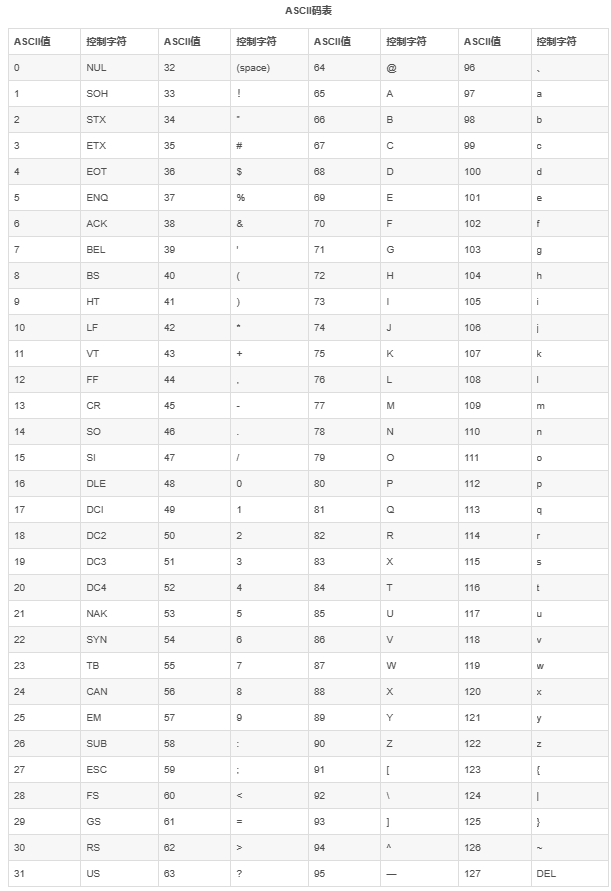

## 5、字符串

**1、字符与整数的联系——ASCII码**

每个常用字符都对应一个-128 ~ 127的数字，二者之间可以相互转化。注意：目前负数没有与之对应的字符。



ASCII扩展字符——（为了适应更多字符）128-255，或者-128~-1,其中，-128对应128，依次递增对应。

```java
import java.util.Arrays;

public class Main {
	public static void main(String[] args) {
        char c = 'a';
        System.out.println((int)c);
        
        int a = 66;
        System.out.println((char)a);
    }
}
```

常用ASCII值： 'A'- 'Z'是65 ~ 90，'a' - 'z'是97 - 122，0 - 9是 48 - 57

字符可以参与运算，运算时会将其当作整数

```java
import java.util.Arrays;

public class Main {
     public static void main(String[] args) {
         int a = 'B' - 'A';
         int b = 'A' * 'B';
         char c = 'A' + 2;
         
         System.out.println(a);
         System.out.println(b);
         System.out.println(c);
     }
}
```

2、String类

初始化：

```java
String a = "Hello World!";
String b = "My name is";
String x = b; //存储到了相同地址
String c = b + "abc"; //String可以通过加号拼接
String d = "My age is" + 18; //int会被隐式转化成字符串“18”
String str = String.format("My age is %d", 18);//格式化字符串，类似于printf
String money_str = "123.45";
double money = Double.parseDouble(money_str);//String转double
```

只读变量，不能修改，例如：

```java
String a = "Hello";
a += "World";//会构造一个新的字符串
```

访问String中的字符：

```java
String str = "Hello World";
for (int i = 0; i < str.length(); i++){
    System.out.print(str.charAt(i));//只能读取，不能写入
}
```

常用API:

- length()：返回长度
- split(String regex)：分割字符串
- indexOf(char c)、indexOf(String str)、lastIndexOf(char c)、lastIndexOf(String str)：查找，找不到返回-1
- equals()：判断两个字符串是否相等，注意不能直接用==
- compareTo()：判断两个字符串的字典序大小，负数表示小于，0表示相等，正数表示大于
- startsWith()：判断是否以某个前缀开头
- endsWith()：判断是否以某个后缀结尾
- trim()：去掉首尾的空白字符
- toLowerCase()：全部用小写字符
- toUpperCase()：全部用大写字符
- replace(char oldChar, char newChar)：替换字符
- replace(String oldRegex, String newRegex)：替换字符串
- substring(int beginIndex, int endIndex)：返回[beginIndex, endIndex)中的子串
- toCharArray()：将字符串转化成字符数组


**3、输入与输出**

```java
import java.util.Scanner;

public class Main {
	public static void main(String[] args){
        Scanner sc = new Scanner(System.in);
        String str1 = sc.next();//输入字符串，遇到空格、回车等空白字符时停止输入
        String str2 = sc.nextLine();//输入一整行字符串，遇到空格不会停止输入，遇到回车才停止
        
        System.out.println(str1);//可以直接输出
        System.out.printf("%s\n", str2);//也可格式化输出，用 %s 表示字符串
    }
}
```

**4、StringBuilder、StringBuffer**

String不能被修改，如果打算修改字符串，可以使用StringBuilder和StringBuffer

StringBuffer线程安全，速度较慢；StringBuilder线程不安全，速度较快

```java
StringBuilder sb = new StringBuilder("Hello");
sb.append("World");
System.out.println(sb);

for(int i = 0; i < sb.length(); i++) {
	sb.setCharAt(i, (char)(sb.charAt(i) + 1))
}
System.out.println(sb);

```

常用API：

reverse（）:翻转字符串